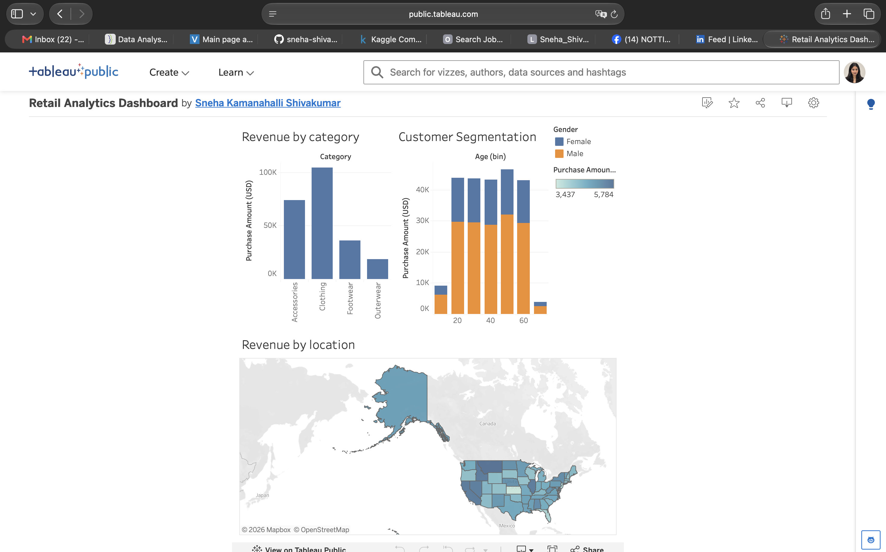

# Retail Analytics Dashboard

An interactive BI dashboard analysing retail transaction data — built to support sales, demographic, and regional decision-making for a retail business.

**[View the live, interactive dashboard on Tableau Public →](https://public.tableau.com/app/profile/sneha.kamanahalli.shivakumar/viz/RetailAnalyticsDashboard_17910164092350/RetailAnalyticsDashboard)**

## The problem

A retail business needs a single view that answers three different stakeholder questions at once: which product categories drive revenue, where customers are spending geographically, and how spending varies across customer demographics. This dashboard brings those three views together so a sales, marketing, or merchandising team can act on them without needing to run their own analysis.

## The data

**Source:** [Kaggle — Customer Shopping Latest Trends Dataset](https://www.kaggle.com/datasets/bhadramohit/customer-shopping-latest-trends-dataset)
3,900 retail transactions, covering product category, purchase amount, customer demographics, and US state-level location data.

**A scoping note:** the original brief for this project called for revenue trend analysis over time. This dataset has no date field, so that metric isn't reliably buildable from it — rather than force a misleading time series, the dashboard focuses on the segmentations the data actually supports well: category, location, age, and gender.

## What's in the dashboard

**Revenue by Category** — Clothing is the clear leader at $104,264 in total revenue, more than Accessories ($74,200) and Footwear ($36,093) combined, with Outerwear trailing at $18,524.

**Customer Segmentation (Age × Gender)** — spend is fairly consistent across age brackets, with the 50-59 group leading slightly. Male customers show a notably higher share of total spend within each age bracket than female customers in this dataset.

**Revenue by Location** — a US state-level map shaded by total purchase amount, highlighting which states drive the most spend geographically — useful for region-specific marketing or inventory decisions.

## How it was built

- **Tool:** Tableau Public (chosen over Power BI as this was built on macOS, where Power BI Desktop isn't available)
- **Data prep:** the dataset was already clean (no missing values or duplicates), so work focused on binning (10-year age groups) and geographic role assignment for the Location field
- **Design choices:** each sheet uses a single, consistent measure (Purchase Amount) so the three views stay comparable at a glance; colour is used meaningfully (Gender split, spend intensity) rather than decoratively

## What I'd do next

- Add a time dimension if transaction-date data becomes available, to support real trend analysis
- Add a customer-level retention/frequency view using the dataset's "Frequency of Purchases" field
- Build a drill-down from the location map into category breakdown per state
